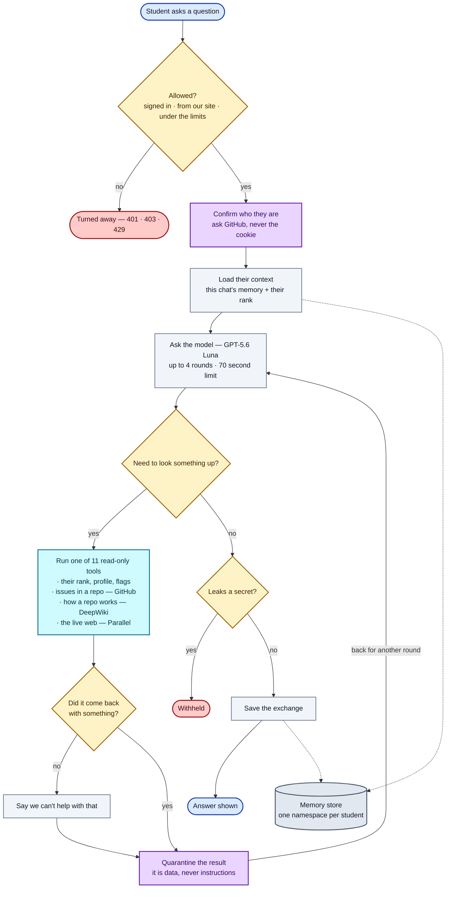

# Kairi — how one question flows through the system

**Reading it:** everything runs top to bottom. Two side exits — `Turned away` and `Withheld`. One loop: the model can call tools and come back, up to 4 times.

| Colour | Meaning |
|---|---|
| 🟦 blue | start and finish |
| 🟨 amber | a decision |
| 🟪 purple | a security step |
| 🟦 cyan | the tools Kairi can use |
| ⬜ grey | an ordinary step, or our storage |
| 🟥 red | the request stops here |

The parts this diagram simplifies

- **"Allowed?"** is really 7 checks in a fixed order: kill switch → provider configured → same-origin → verified session → per-minute limit → per-day limit → budget reserved. Each has its own status code. The order matters: identity is checked before anything is spent.
- **"Run one of 11 read-only tools"** is: their rank/profile/flags = `get_my_standing`, `lookup_contributor`, `compare_contributors`, `explain_flag`, `site_help`. issues in a repo = `find_repo_issues`, `find_good_first_issues`. how a repo works = `explain_repo`, `repo_overview`. the live web = `web_search`, `read_url`.
- **"Did it come back with something?"** covers two separate cases: a repository DeepWiki has never indexed, and a search that found nothing usable. Both are said plainly rather than guessed around.
- **"Quarantine the result"** only wraps tools that return other people's words — issue titles, web pages, repo docs. Tools returning our own text skip it.
- **Not shown:** the optional Rust sidecar (built, not deployed), and budget refunds on every failure path.

## How an answer reaches the screen

`POST /api/agent` answers as a `text/event-stream` when the browser asks for one (the console always does). The frames, in order:

| Event | When | What the console does with it |
|---|---|---|
| `status` | before each model call | shows "Thinking" / "Working it out" / "Writing the answer" |
| `tool_start` | a tool is dispatched | adds a step with a spinner and a plain-language label ("Studying how that repo works — owner/repo") |
| `tool_end` | the tool returned | ticks the step and shows how long it took |
| `delta` | a slice of the answer | appends it to the article as it is written |
| `done` | the run finished | replaces the draft with the authoritative reply, saves the session id, shows the footer |
| `error` | the run failed | shows the message, puts the question back in the box |

A keepalive comment goes out every 15 seconds so the Cloudflare Tunnel never sees an idle connection. Everything that can *refuse* a request (kill switch, origin, sign-in, limits, budget, body shape) still returns a plain JSON status before the stream starts, so the client has one place to branch on errors. Without an `Accept: text/event-stream` header the same route returns one JSON object, which is what `curl` and the tests use.

The answer text is scanned for secrets and prompt echoes *as it streams*: the last 64 characters are always held back until the scanner has cleared them, so a token split across two provider chunks can never partly escape. The types and the parser live in `lib/agent-events.ts`.

## Answer format

The model is asked to write like a technical blog post — direct answer first, `##` sections, numbered steps, fenced code, a table for comparisons, one-line `> **Tip:**` callouts, a `## Sources` list of the links a tool returned, and a `## Next Step`. `lib/markdown-lite.ts` parses exactly that subset (no raw HTML, no images, https-or-relative links only) and `app/components/MarkdownLite.tsx` renders it as React elements. Every answer card has Copy and Download .md, and reopened chats render with the same formatting because message bodies are stored with their newlines intact.

## Launch checklist

Before a day when many people will try Kairi at once:

1. **Provider key.** `LLM_API_KEY` in the cluster secret must be a key you are allowed to serve a campus from. The Hack Club proxy used in local development is teens-only and forbids proxying; do not ship it.
2. **Budget knobs.** `LLM_MINUTE_BUDGET` is a global ceiling on agent runs per minute (default 30). Set it to at least the number of simultaneous testers, and make sure the provider's own requests-per-minute can carry 4× that. Per-student limits are `AGENT_USER_BURST` (default 6/min) and `AGENT_USER_DAILY` (default 40/day).
3. **KV.** Chats and rate limits live in Upstash; the on-disk fallback only works on one pod. Confirm `KV_REST_API_URL` and `KV_REST_API_TOKEN` are set.
4. **Image tag.** `k8s/02-deployment.yaml` pins an image by short SHA. Build and push the image for the merged commit, `kubectl set image`, then update the pinned tag.
5. **Smoke test after deploy.** Sign in, open `/kairi`, ask "What is a pull request?" (no tools, ~2s), then paste a repo link (DeepWiki + GitHub, ~20s). Both should stream, and the chat should reappear in the sidebar after a reload with its formatting intact.
6. **Off switch.** `ASSISTANT_DISABLED=1` stops all spend without a redeploy.
